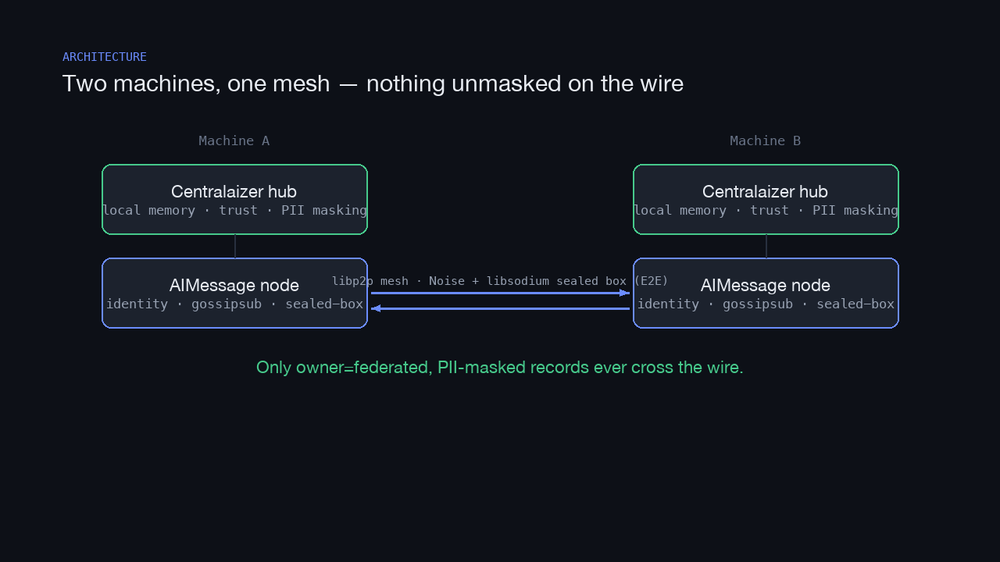
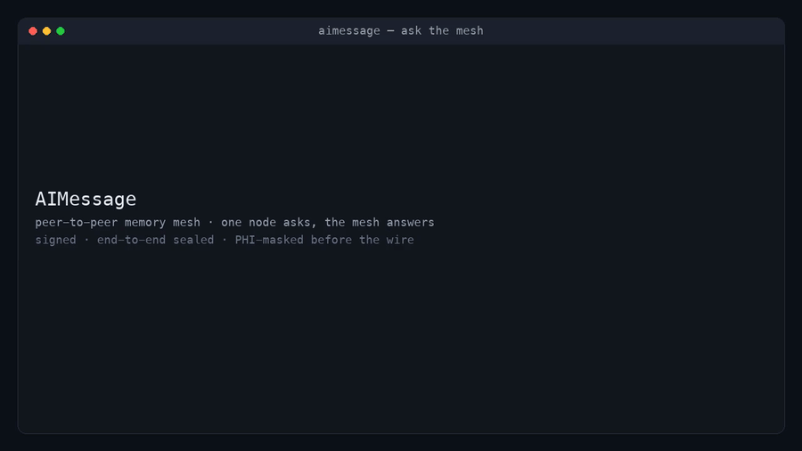
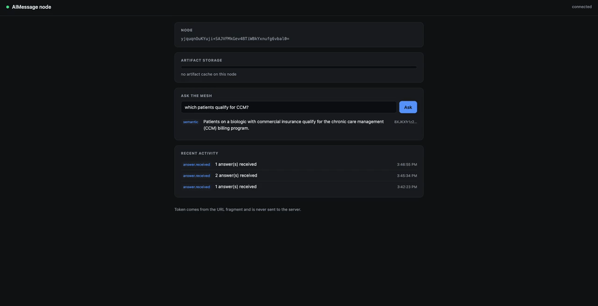

# AIMessage

> A peer-to-peer network for AI agents to share **knowledge, plugins, and MCP servers** —
> like Napster/BitTorrent, but for agent memory, with de-identification and end-to-end encryption.

**Status:** **v0.10.2** — all 7 roadmap phases shipped; the product loop (agent → hub → mesh → agent) is
**verified live**, the **two-machine WAN hop is verified** (real hardware + a reproducible container test),
and a node is deployable as an always-on daemon. 18 tagged releases (v0.1.0 … v0.10.2). Test suite:
**23 files / 163 tests, green** — incl. load/soak (pure + libp2p + docker CI legs).
See [Current results](#current-results-verified) and [`docs/DEPLOY.md`](docs/DEPLOY.md).

**License:** Apache-2.0 — free to use, modify, and distribute with no fees. The whole dependency
stack is permissively licensed (see [Licensing](#licensing)), so nodes can be redistributed freely.

---

## How it works

📹 **[54-second walkthrough video](docs/media/how-it-works.mp4)** — title → architecture → product loop → the real CLI + dashboard clips → cross-internet relay.



Diagrams & stills:
- [Architecture](docs/media/architecture.png) — two machines, one mesh; only masked, federated records cross the wire
- [The product loop](docs/media/product-loop.png) — agent → hub → mesh → agent (+ Phase 7 write-back)
- [Cross-internet relay](docs/media/relay.png) — two NATed peers meshing through one public relay
- [CLI](docs/media/aimessage-ask.png) · [Dashboard](docs/media/aimessage-dashboard.png) — real screenshots ([CLI clip](docs/media/aimessage-ask.gif) · [dashboard clip](docs/media/aimessage-dashboard.gif))

## What it is

Every AI agent today has an isolated memory. Knowledge built in one tool vanishes in the next.
[Centralaizer](https://github.com/lestercoyoyjr/Centralaizer) solves this *locally* — one shared
memory hub per machine. **AIMessage is the network layer**: it lets those local hubs find each
other and answer *"has anyone solved this job before?"* across a peer-to-peer mesh — without a
central server, without cloud egress by default, and without leaking PHI/PII.

Think of it as **WhatsApp for agent knowledge**:

| WhatsApp | AIMessage |
|---|---|
| Phone number | Node identity = a keypair (libp2p PeerID) |
| Contacts | Peers you've accepted |
| "Anyone online who knows X?" | Signed query fan-out over gossipsub |
| Sending a file | Content-addressed artifact (memory / plugin / MCP server) |
| End-to-end encryption | Payloads sealed to the recipient's public key (libsodium) |
| Server federation | Each hub is its own node; they mesh directly |

## Three things get shared — at three different risk levels

1. **Knowledge / memory** — signed, de-identified JSON records. Low risk.
2. **Plugins** — code. **Arbitrary-code-execution risk.** Signed + content-pinned + human-gated install. ✅ `artifact.py`
3. **MCP servers** — code. Same risk as plugins. Never auto-install, never auto-run. ✅ `artifact.py`

Artifact sharing (2 & 3) is built: content-addressed (sha256 = id), Ed25519-signed manifest,
fetch-by-hash + verify-on-arrival, and an `install()` that refuses unless a human `approve()`
returns `True` — then *extracts only* (stdlib `data` filter blocks tarbombs/traversal) and never
runs anything. `python demo/demo_artifact.py`. Sandboxing before you *run* an installed artifact is
still open (Phase 6).

The artifact store is a **bounded LRU cache** (`aimessage/storage.py`, default 10 GiB): only the
evictable artifact cache is capped — memories are never evicted. Over quota → least-recently-used
artifacts are dropped; a serve hit marks recency; an evicted blob is simply re-fetched by hash.

**Overflow (v0.3.0):** `TieredArtifactCache` spills evicted artifacts to a pluggable cold store as
**ciphertext** (client-side `SecretBox`, key derived from the node's identity), and transparently
pulls them back (decrypt → verify hash → re-admit) on a hit. `LocalDirColdStore` pointed inside a
Google Drive / Dropbox synced folder gives encrypted overflow with **zero API code** — the cloud only
ever sees ciphertext. Only artifacts spill; memories never leave.

A native **Google Drive API** backend also exists (`aimessage/gdrive.py`, `pip install ".[gdrive]"`):
`GDriveColdStore` stores encrypted blobs in a Drive app folder and reads `storageQuota`. When both the
local cache and Drive are full, the tiered cache drops the coldest artifact (re-fetchable by hash),
keeps serving, and emits a `storage.full` event with the Google One upgrade link — the app **never
buys storage**; that's your action.

## The two security guarantees (they are NOT the same)

- **E2E encryption** protects data *on the wire* (libp2p Noise + per-message libsodium sealed box).
- **De-identification** is the *compliance* control. **Encryption alone does not make PHI-sharing
  HIPAA-legal.** So PHI never leaves a node: Centralaizer masks PII/PHI at write time, and only
  masked, `owner=federated` memories are ever published. You share the *lesson*, not the *patient*.

## Architecture

```
  Machine A                                Machine B
┌───────────────────┐                    ┌───────────────────┐
│ Centralaizer hub  │                    │ Centralaizer hub  │
│  (local memory,   │                    │  (local memory,   │
│   trust, masking) │                    │   trust, masking) │
│        │          │                    │        │          │
│   AIMessage node  │◄── libp2p mesh ───►│   AIMessage node  │
│  identity·gossip· │   Noise + sealed   │  identity·gossip· │
│  DHT·sealed-box   │       box (E2E)     │  DHT·sealed-box   │
└───────────────────┘                    └───────────────────┘
   only owner=federated, masked records ever cross the wire
```

AIMessage depends on Centralaizer for storage, trust scoring, and masking. It adds: node identity,
the encrypted channel, the query/reply primitive, content-addressed artifact exchange, and the
propagated-tombstone erasure model.

## The product loop (verified live)



*A real `aimessage ask` run: a node broadcasts a question and gets back a signed, decrypted,
`verified=True` answer from the mesh. ([MP4](docs/media/aimessage-ask.mp4) · [still](docs/media/aimessage-ask.png))*

The whole point, end to end — **agent → hub → mesh → agent**:

```
Agent A ──MCP memory_write──▶ Centralaizer hub ◀──/api/search── node1 (--centralaizer, in the mesh)
                                                                   │ gossipsub (Noise + sealed box)
node2 ──ask / dashboard──▶ mesh ──▶ node1 seals A's memory back ──▶ node2   ( = Agent B retrieves )
                                                                   │
                              (Phase 7) node2 --writeback──▶ Agent B's own hub  ← memory_search now finds it
```

A real MCP `memory_write` from Claude Desktop lands in the hub (PII-masked); a `--centralaizer` node
federates it into the mesh; a second node retrieves it as a **signed, E2E-sealed** answer — and with
`--writeback`, absorbs it into the asking agent's *own* hub so its `memory_search` returns it next
time. Reproduce it:

```bash
demo/run_product_loop.sh          # single-machine: MCP write → hub → mesh → node2 retrieval
demo/run_two_hub_writeback.sh     # two hubs: A's memory crosses the mesh into B's separate hub
```

## Mesh → hub write-back (Phase 7)

The mirror of the erasure poller (which runs hub → mesh): accepted, corroborated mesh answers are
written back into the local hub, tagged `source=mesh` + `origin_node` + `content_address` (auditable,
never look locally authored, tombstone-matchable). Two independent trust gates — mesh-side
corroboration / `trusted_origins`, and the hub's own trust gate + PII mask — plus hub-side cosine
dedup (idempotent) and tombstone-awareness (skips locally-revoked). `aimessage ask --writeback
HUB_URL`, or the dashboard's "Ask the mesh" box when the node runs `serve --writeback`.

## Deploying (always-on node + human testing)

Local-first, so "deploy" = run a persistent node and wire the test setup. See
[`docs/DEPLOY.md`](docs/DEPLOY.md) for the full runbook (machine-2 join, real MCP-agent write side,
WAN/NAT caveat). Quick version:

```bash
scripts/install-launchagent.sh    # com.aimessage.node — RunAtLoad + KeepAlive, hub-backed bootstrap
                                  # serves --control (dashboard) --writeback --notify on fixed ports
```

Connect real MCP agents (Claude Desktop / Cursor / Claude Code / VS Code) to the hub so their writes
federate — via Centralaizer's `connect_agents_cli.py`. A second machine on the **same LAN** joins with
`aimessage ask --bootstrap /ip4/<host-LAN-IP>/tcp/4210/p2p/<peer-id> "<query>"`. **WAN caveat:**
py-libp2p 0.7.0 has no NAT traversal — cross-internet needs port-forwarding or a relay (Phase 6).

## Current results (verified)

Last verified 2026-09-22 on a live deployment:

| Check | Result |
|---|---|
| Test suite | **22 files / 155 tests green** (unit + integration + regression + edge + sanitization + libp2p + docker) |
| Product loop (`run_product_loop.sh`) | ✅ MCP write → hub → mesh → node2 verified, E2E-sealed answer |
| Two-hub write-back (`run_two_hub_writeback.sh`) | ✅ A's memory crosses the mesh into B's separate hub (`agent_id=mesh-writeback`) |
| Live write→ask smoke (real hub) | ✅ retrieved + `verified=True`; **PHI masked upstream** (numeric token → `PHONE_1` before the wire) |
| Deployed node daemon | ✅ `com.aimessage.node` running, dashboard live, forgotten-poller active |
| Releases | v0.1.0 … **v0.8.0** (14) |

## Licensing

| Component | License | Redistributable? |
|---|---|---|
| libp2p | MIT + Apache-2.0 | ✅ |
| libsodium / PyNaCl | ISC / Apache-2.0 | ✅ |
| FastMCP, ChromaDB | Apache-2.0 | ✅ |
| DuckDB, spaCy, Ollama | MIT | ✅ |
| SQLite | Public domain | ✅ |
| nomic-embed-text, Qwen3 | Apache-2.0 | ✅ |
| A2A protocol spec | Apache-2.0 | ✅ |

**Avoided:** (A)GPL deps (would force downstream nodes open) and Llama models (Meta Community
License is not OSI-open). Qwen3 covers reasoning under Apache-2.0.

## Transports

Two, sharing the exact same signed-query/E2E-seal primitive (`protocol.handle_query`):

- **Socket** (`transport.py`, stdlib) — localhost, zero extra deps. Default for demos, tests, CI.
- **libp2p** (`libp2p_transport.py`, optional) — Noise-encrypted streams, multiaddr + PeerID,
  dialable across machines/NAT. The node's PeerID derives from its Ed25519 signing identity.
  ```bash
  pip install ".[libp2p]"                  # heavy: trio, grpcio, aioquic
  python demo/demo_libp2p.py
  ```
- **gossipsub broadcast** (`gossip.py`, optional) — the "ask the whole mesh" primitive: shout a
  query to a topic, whoever holds a federated hit seals an answer back. No need to know peers up
  front.
  ```bash
  python demo/demo_gossip.py   # 3-node mesh; bystander with only a personal record stays silent
  ```
  ```bash
  python demo/demo_dht.py   # join a mesh knowing ONLY a bootstrap address
  ```
  Nodes advertise + find each other under a DHT rendezvous key, so joining needs just one bootstrap
  address. (Honest caveat: py-libp2p 0.7.0's provider lookup is flaky on tiny localhost nets, so
  today's reachability leans on the bootstrap gossipsub relay; the DHT layer is wired for real scale.)

## Install

```bash
pip install .            # core (pynacl) + the `aimessage` command
pip install ".[libp2p]"  # + the real libp2p transport (heavy: trio/grpcio/aioquic)
pip install -e .          # editable, for development
```

Packaging is defined in `pyproject.toml` (single source of dependencies). Installing puts an
`aimessage` console script on your PATH (equivalent to `python -m aimessage`).

## Running a node

Needs the libp2p extra (`pip install ".[libp2p]"`).

```bash
# Start a bootstrap peer that serves memories from a file (prints NODE_MULTIADDR):
python -m aimessage serve --listen /ip4/0.0.0.0/tcp/4001 --memories mymemories.json
# ...or back it with a running Centralaizer hub:
python -m aimessage serve --centralaizer http://127.0.0.1:3001

# From another machine/terminal, ask the mesh (join via the bootstrap's multiaddr):
python -m aimessage ask "which patients qualify for CCM?" --bootstrap /ip4/<host>/tcp/4001/p2p/<id>

python -m aimessage id          # print this node's id
```

A `--memories` file is a JSON list of `{content, type?, owner?, trust_score?}`; entries default to
`federated` and are signed with the node's key on load. Only `federated` memories are ever served.

**Notifications:** `serve` logs a live `[event]` line for every inbound question / answer. Add
`--notify` for OS desktop notifications (terminal-notifier / notify-send) — coalesced + rate-limited
(a query flood becomes one "(+N more)" notification), with a minimal body by default so memory content
stays in-app; `--notify-preview` opts into a truncated preview.

## Docker

```bash
docker build -t aimessage .          # light image: pure-stdlib core (pynacl only)
docker run --rm aimessage            # runs the socket demo (proof of life)
docker build --build-arg WITH_LIBP2P=1 -t aimessage:libp2p .   # + real libp2p transport (heavy)
```

The default image is intentionally small (no libp2p). CI builds it and runs the demo inside, so the
Dockerfile stays verified. To run the node **daemon** in a container, build with libp2p and invoke
the CLI:

```bash
docker build --build-arg WITH_LIBP2P=1 -t aimessage:libp2p .
docker run --rm -p 4001:4001 aimessage:libp2p \
  python -m aimessage serve --listen /ip4/0.0.0.0/tcp/4001 --memories /app/mymemories.json
```

## Branching & CI

- `main` = prod · `staging` = pre-prod · `develop` = active work.
- Flow: commit to `develop` → PR into `staging` → PR into `main`.
- **CI** (`.github/workflows/ci.yml`) runs the test suite on every push and PR.
- **Branch guard:** server-side protection needs GitHub Pro or a public repo. On the free
  private plan a client-side hook stands in. Enable it once per clone:
  ```bash
  git config core.hooksPath githooks   # blocks direct pushes to main/staging
  ```

## Docs

- [`docs/ROADMAP.md`](docs/ROADMAP.md) — the 6-phase build plan
- [`docs/PAPERS.md`](docs/PAPERS.md) — research foundation (20 papers, 7 sequenced as prerequisites)
- [`tasks/todo.md`](tasks/todo.md) — live task checklist

## Web dashboard



*Real screen capture: the node's browser dashboard — node id, storage meter, "Ask the mesh", and a
live event feed that updates as the mesh is queried. ([MP4](docs/media/aimessage-dashboard.mp4) · [still](docs/media/aimessage-dashboard.png))*

`aimessage serve --control` starts a token-gated localhost control API and prints a
`DASHBOARD=http://HOST:PORT/#TOKEN` URL (fix the port with `--control-port`). Open it in any browser
for a live view of the node: id, artifact-storage meter, a real-time event feed (questions in, answers
sent/received), and an interactive **"Ask the mesh"** box that broadcasts a query and renders the
verified answers. With `serve --writeback` it also absorbs those answers into the local hub and shows
"absorbed N answer(s) into your hub" (Phase 7). The token rides in the URL fragment (never sent to the
server); data endpoints require it; peer-supplied text is rendered as text (no injection). No
toolchain, no build step — the page is served by the node itself.

A **native desktop app** wraps this same UI without a Rust/Node toolchain: `pip install ".[desktop]"`
then `python desktop/app.py` opens the dashboard in an OS webview and auto-starts a node sidecar
(`--selfcheck` verifies the handshake headlessly). A signed Tauri bundle remains a later option.

## Trust anchor (anti-sybil)

Ranking prefers memories from origins you explicitly trust. Manage the allowlist:

```bash
aimessage trust add <node-id>     # a peer's node id (b64 Ed25519 pubkey)
aimessage trust list
aimessage trust remove <node-id>
```

`serve` loads it (`--trust-file`, default `~/.aimessage/trusted.json`); trusted origins outrank any sybil's raw corroboration count. It's an operator-curated allowlist — no auto-trust — so a resourceful sybil minting keys still can't outrank a peer you've vouched for.
